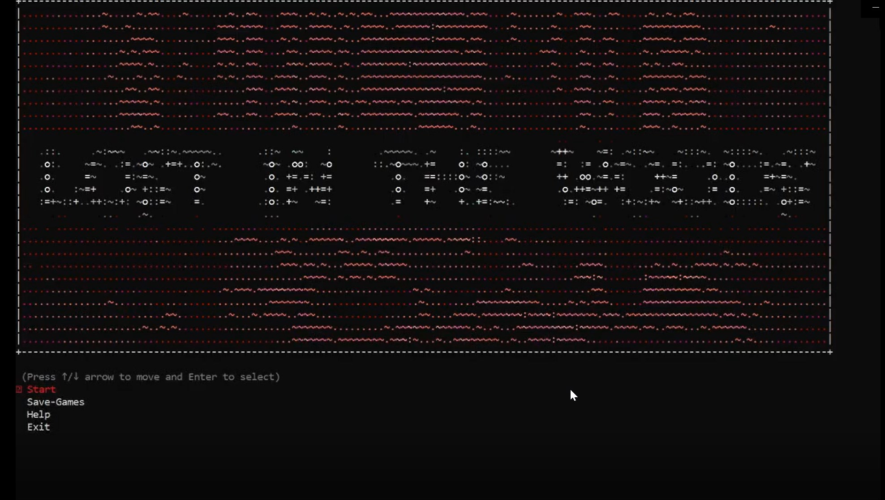
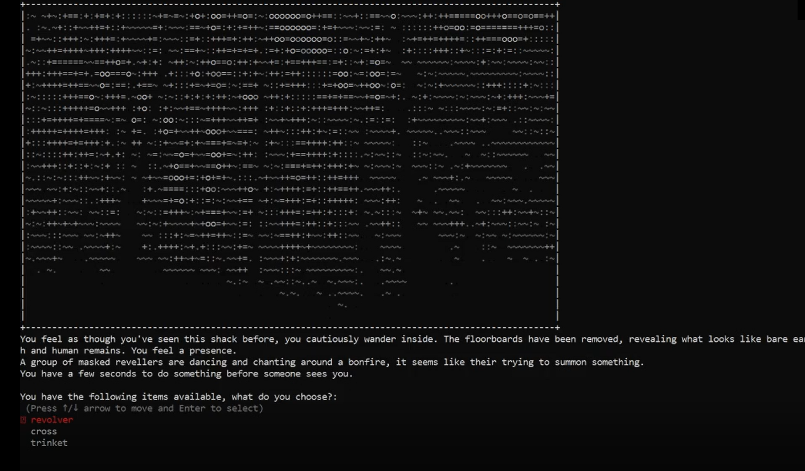
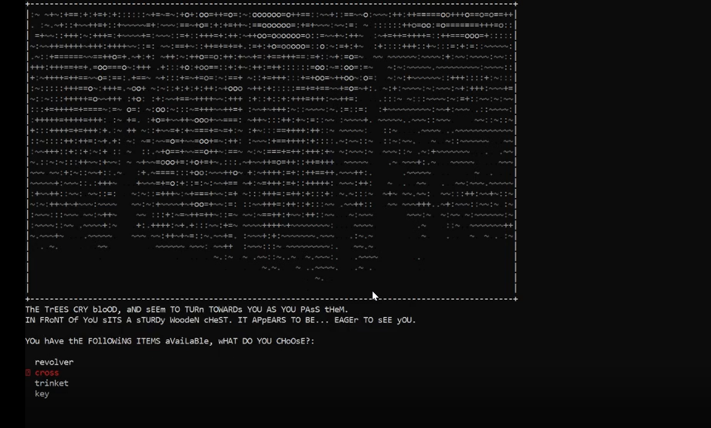
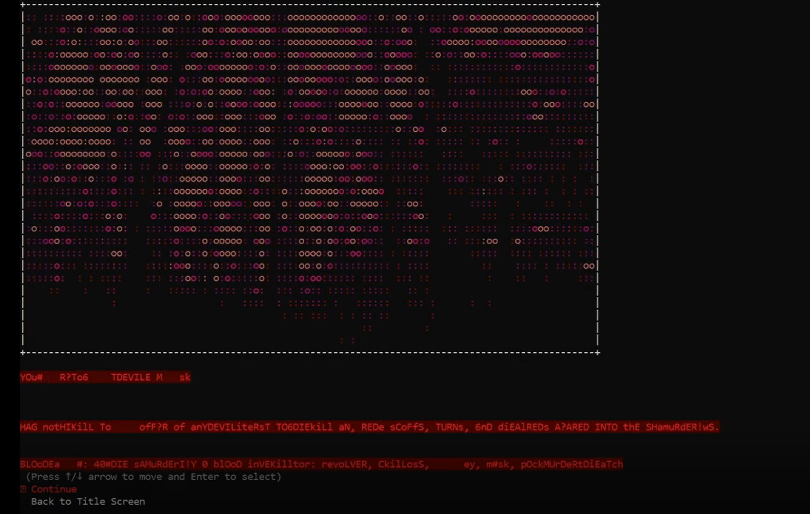

#### README

Before continuing ensure you are running either Windows Subsystem for Linux (WSL) or Mac OS with a ruby interpreter such as rbenv installed. The version of ruby needs to be atleast 2.7.1, as the code implementation uses method functionality only recently added to ruby.

To install:

1. Please ensure you are currently in the directory of this help file.
2. Please enter 'gem install bundler' into your terminal if you do not have the ruby bundler gem installed
3. Please run './installer.sh' from the terminal in this directory to install gem dependencies
    - If this fails please refer to the ruby Gemfile in this folder and install the prerequisite gems
    - If you cannot find this file, the list of gem dependencies are:
        - gem 'json'
        - gem 'tty-prompt'
        - gem 'rmagick'
        - gem 'asciiart'
        - gem 'rainbow'
        - gem 'optparse'
        - gem 'tty-font'
4. Please run ./lostinthewoods.sh to run the program. Run ./lostinthewoods.sh --help for help information.

#### Features: 
Lost in the Woods is a ruby interpreted terminal app text adventure. 
The game includes persistent save games, a randomly generated (each element pre-written) series of encounters and areas in a dark, foreboding forest!

During the game loop the player will use items, gain or lose sanity and/or health, and gain or lose items from their inventory. Depending on your sanity level, the game will display text differently, with random capitalisation, and turning some of it red.
Finally, every time you die (for each save file) the game will remember and change the descriptions of enemy encounters and areas that you died to/in.

#### Screenshots
Screenshot One - Main Menu

Screenshot Two - Normal Sanity Encounter Expl.

Screenshot Three - Med Sanity Encounter Expl.

Screenshot Four - Low Sanity Encounter Expl.
